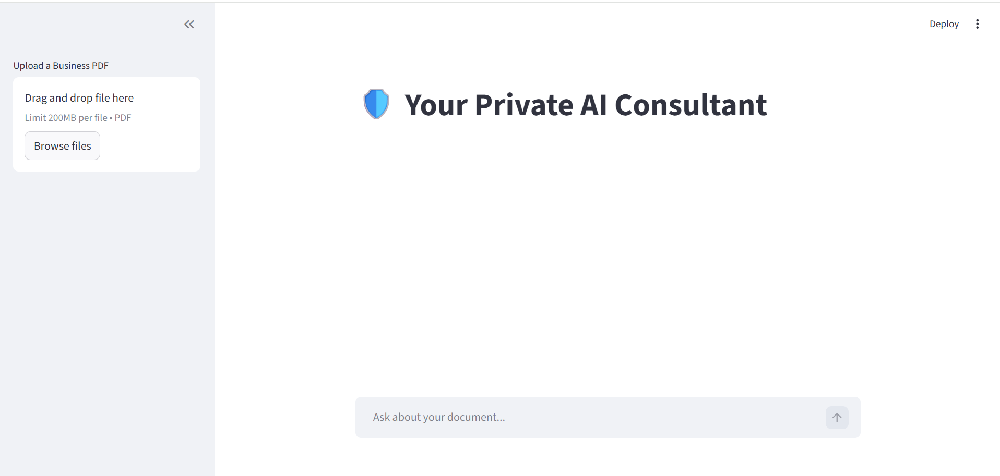
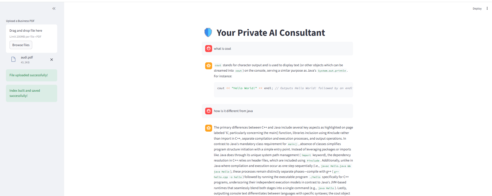

## A production-grade conversational RAG system built with:

A secure, memory-aware Retrieval-Augmented Generation (RAG) system that allows users to upload documents and interact with them through a conversational AI — powered entirely by local models.

No OpenAI. No external APIs. Fully self-hosted.

- 🦙 LlamaIndex
- 🧠 Ollama (phi3:mini)
- 📄 Hybrid Retrieval
- 🌐 Streamlit UI
- 💾 Persistent Vector Storage

## 🚀 Overview

This project implements a Private AI Consultant that:

📄 Accepts PDF uploads

🧠 Retrieves relevant content using vector search

💬 Maintains conversational memory

💾 Persists indexed knowledge across restarts

🔒 Restricts answers strictly to uploaded documents

Unlike basic semantic search systems, this behaves like a consultant — it remembers context and answers intelligently within document boundaries.

## 🚀 Features

- Conversational memory (chat-aware engine)
- Persistent indexing (no re-embedding on restart)
- Secure document-based answering
- Local LLM deployment (no OpenAI dependency)
- Docker-based Ollama setup

## 🏗 Architecture

 User
   ↓
Streamlit Interface
   ↓
Chat Engine (Memory Enabled)
   ↓
Vector Retrieval (Hybrid RAG)
   ↓
Local LLM (phi3:mini via Ollama)
   ↓
Grounded Response


## 🛠 Tech Stack

- Python
- Streamlit
- LlamaIndex
- Ollama
- Docker

## 📦 How to Run

```bash
pip install -r requirements.txt

streamlit run app.py
```

## DEMO

### 🖥️ User Interface


### 🧠 Conversational Memory



## 🎯 Why This Project Matters

Most RAG tutorials stop at semantic search.

This implementation focuses on:

Conversation-aware retrieval

Persistence strategies

Local deployment optimization

Hardware-efficient configuration

Production-style architecture separation

It bridges the gap between demo project and real-world system design.
